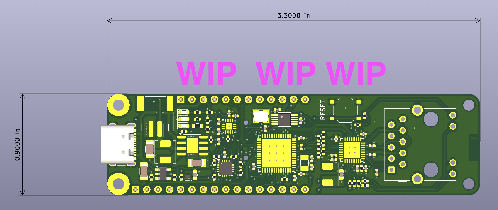

# Project codename "remex"

> remex (noun)
>> a primary or secondary quill feather of the wing of a bird

This is intended to be a "maker"-friendly board for the CH32V307 RISC-V microcontroller from [WCH](https://www.wch-ic.com/). The main selling points are gigabit Ethernet and USB-C including host support.

## Status

There's a vaguely-complete layout, but actual ordering is pending final schematic review as well as further stress-testing of the chosen LiPo charger circuitry.
